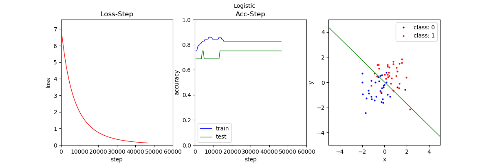
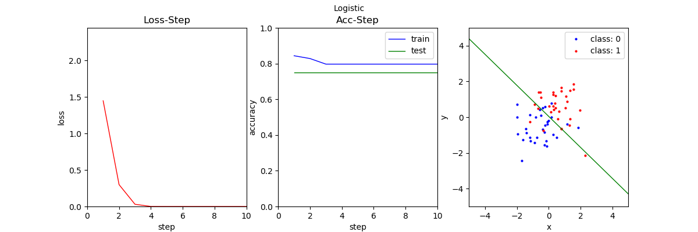
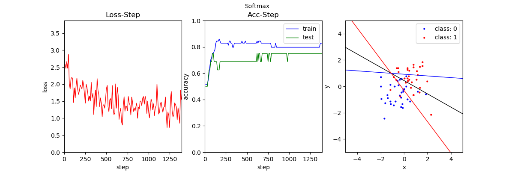
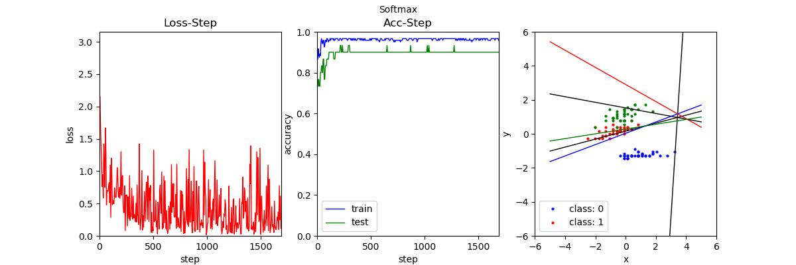
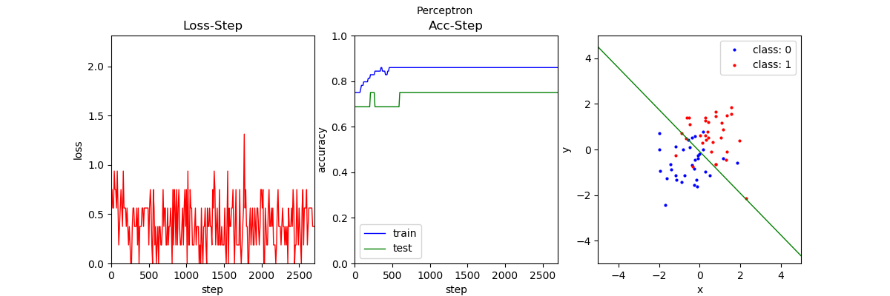
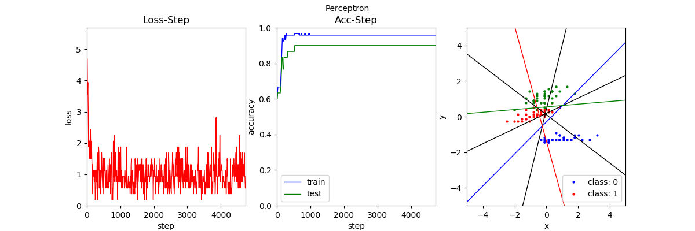

# Intro
linear_classifier.py contains Logistic regression, Softmax regression, and Perceptron algorithms. Run the program by uncommenting the corresponding code in main.py.

# More Details
Logistic regression, Softmax regression, and perceptron each class contains four parts: data reading, preprocessing (optional two types of normalization), training, and visualization.

Please see the comments in the code for the description of the parameters of each class. In the visualization part the black line is the classification boundary and the colored line is the discriminant plane of a class.

In Softmax regression and perceptual machine, due to the sharp training loss oscillation and no significant improvement by increasing batch size or decreasing lr, a learning rate decay mechanism is added, which decays by 90% every x steps.

In the multi-category perceptron, the same decision test as Kesler's construction (pattern recognition 4th ed. p. 70) is used since the use of 1 vs 1, 1 vs rest will produce ambiguous regions. That is, the maximum output category is selected as the classification category. The advantage of this discriminant condition over the other is that there is no fuzzy region.

# Results

# Result analysis
From the results of logistic regression, we can see that the Newton iteration is much faster than GD.

The use of SGD causes loss instability, but increases the randomness and may jump out of the local optimal point, as evidenced by several sharp protrusions of the test machine acc in the dichotomous softmax.
