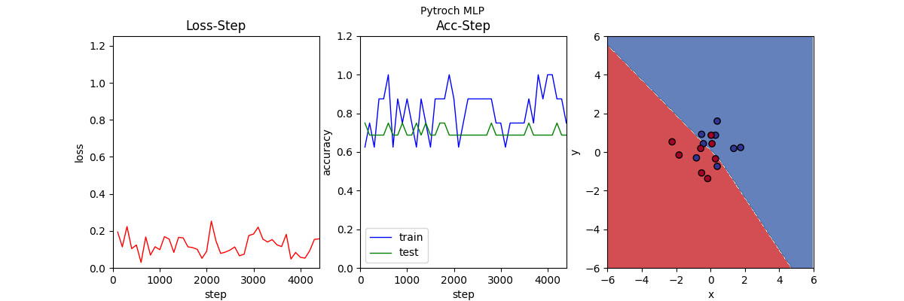
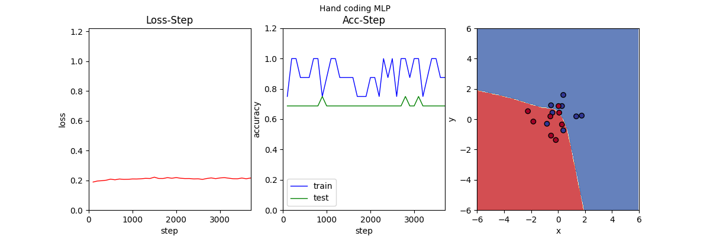
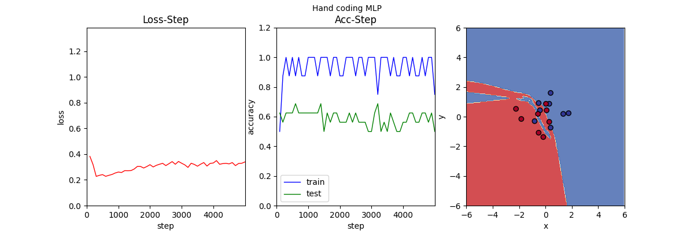
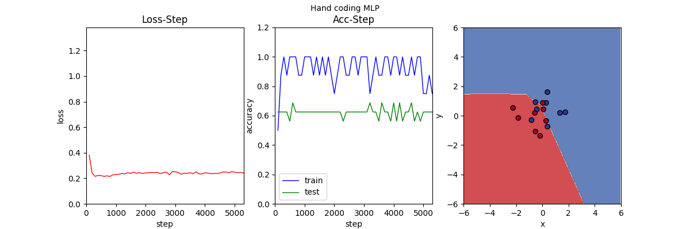
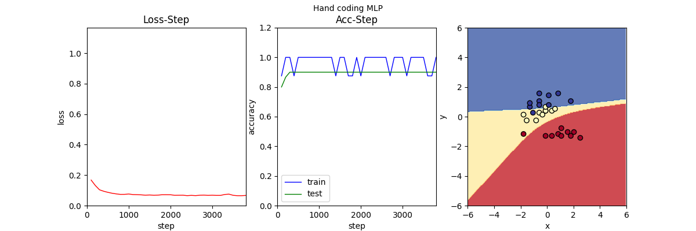
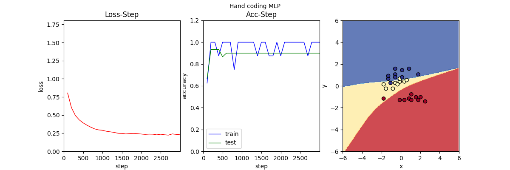
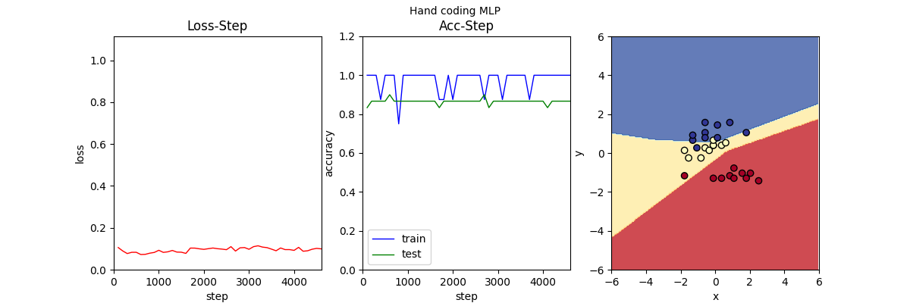
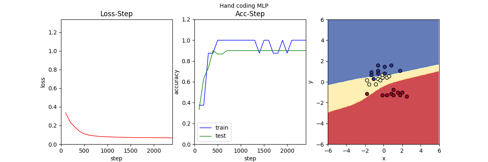
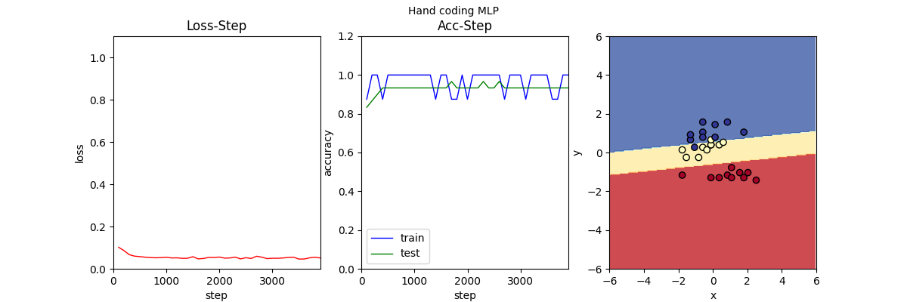

# Algorithms and Principles of AI. Assignment5: MLP
## Code structure
`MLP.py`Contains the hand coding MLP\
`MLP_torch.py`Contains the MLP implemented with pytorch\
`utils.py`Contains visualization method\
`Dataloader.py` Offer methods to load and normalize data

## Quick Start
Directly run MLP.py or MLP_torch.py.

## Explanation of Parameters
### class MLP
`lr`:Learning rate, a preferable performance could be achieve with lr in [0.1, 1] in this case.\
`input dim`:Input dimension, set to 2 in this case.\
`output dim`:Output dimension, equals to the class number of dataset.\
`hidden units`:Hidden units of MLP.\
`hidden layers`:Hidden layers contained in MLP, the first and last layers were excluded.\
`activation function`:Activation function, choose one among `sigmoid`,`softmax`
,`relu`,`tanh`.\
`loss function`:Loss function, choose one between `mse` and `cross_entropy`.\
`regular`:Regularization. choose one among `none`,`l1`,`l2`. `none` means do not
use any regularization.\
`alpha`:The weight of regularization item.

### class Dataloader
`train_input_path`:Path of training input file.\
`train_label_path`:Path of training label file.\
`test_input_path`:Path of testing input file.\
`test_label_path`:Path of testing label file.\
`classes`:Class number of the dataset.\
`batch_size`:How many examples to use for one training.\
`norm`:Whether to normalize the data.

## Results
### Pytorch MLP
\
acc:0.688

\
acc:0.9
### Hand coding MLP
\
loss = `mse`, activation = `sigmoid` --> acc = 0.688

\
loss = `mse`, activation = `sigmoid`, hidden_layer = `5` --> acc = 0.688

\
loss = `mse + l1`, activation = `sigmoid`, hidden_layer = `5` --> acc = 0.688

\
loss = `mse`, activation = `sigmoid` --> acc = 0.9 

\
loss = `cross_entropy`, activation = `sigmoid` --> acc = 0.9

\
loss = `mse`, activation = `relu` --> acc = 0.867

\
loss = `mse`, activation = `tanh` --> acc = 0.9

\
loss = `mse + l1`, activation = `relu` --> acc = 0.933

## Analysis
1.By comparing [model without l1](imgs/cls2_mse_layer5.png) and [model with l1](imgs/cls2_mse_l1_layer5.png),
we can tell that regularization alleviates overfitting. Sometimes regularization could even improve the accuracy:
[example](imgs/cls3_mse_l1_relu.png).\
2.It is illustrated by changing activation function to [sigmoid](imgs/cls3_mse_l1.png), [relu](imgs/cls3_mse_relu.png) or 
[tanh](imgs/cls3_mse_l1_relu.png) that the activation function would affect the final model heavily.
