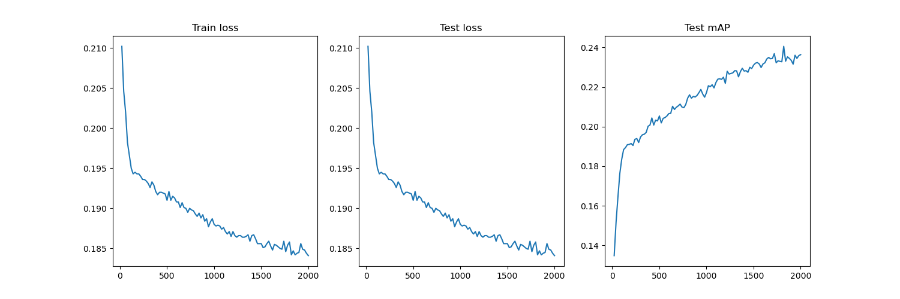

# Structure & Element
- main.py contains the train loop.
- utils.py contains Dataset class for VOC2007 and methods for calculating mAP.
- config.yaml contains all the hyperparameter.

# Quick Start
    python main.py

# Requirements
    vit_pytorch
    pytorch

# Results
